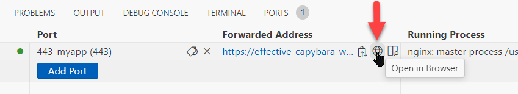

# tlspc-pull-provisioning-examples

This repository provides a demo lab for pull provisioning of TLS certificates from the Venafi TLS Protect Cloud using the Venafi Ansible collection and nginx + php. 

**Ansible** and the **venafi.machine_identity** collections have already been isntalled on this machine, as have some other tools if you wish to fiddle after completing the lab. 

## Lab Prerequisites.
1) If you did not sign up for a Venafi Cloud trial tenant previously, do so at [https://venafi.com/try-venafi/tls-protect/](https://venafi.com/try-venafi/tls-protect/) as it will be needed for this lab

2) Sign up for a github free account to be able to run free codespaces here [https://github.com/signup](https://github.com/signup)
    - Walkthough: https://docs.github.com/en/get-started/start-your-journey/creating-an-account-on-github

3) Ensure you are signed into your github account. 

## Lab Steps

**Part 1: Venafi Onetime setup**
1) Create your own private codespace from this repository by clicking **Code** dropdown button -> **Codespaces** -> **Create Codespace on main**. This will take 2-5 minutes to create.
    - Once it is done creating, a popup in the lower right of this tab will occur. Click **Open in Browser** to open a browser tab that displays the hosted webapp. 
        
    - Copy pasting into this environment is possible if the browser promt is accepted when you firt try to copy paste.
2) Log into your Venafi Cloud trial tenant while your codespace is creating.
3) Modify the preexisting issuing template with the name `Default` to have [Recommended Settings](https://docs.venafi.cloud/vaas/issuing-templates/defining-recommended-settings-for-an-issuing-template/) which include values for the below fields:
    - Organization (O)
    - City (L)
    - State (ST)
    - Country (C)
4) Click **Save** to save your changes to the issuing template.
5) Create an application named `MIM Summit App` and assign it the **Default** issuing template - [Creating Applications](https://docs.venafi.cloud/vaas/application/creating-an-application/)  

&nbsp;

**Part 2: TLS Certificate Automation Setup**
1) Copy your TLSPC API key - [Obtaining your API key](https://docs.venafi.cloud/api/obtaining-api-key/#to-obtain-an-api-key-using-the-tls-protect-cloud-console)  
2) In your browser tab for your codespace, open the credential.yml for editing using `nano credentials.yml` in the terminal.  
3) Change the value of the `token` field to your API key. Ensure that it is wrapped in single quotes.  
    - Example: `token: 'xxxxxxxx-xxxx-xxxx-xxxx-xxxxxxxxxxxx'`
4) Change the value of the `zone` field to `"MIM Summit App\Default"`
    - Case sensitivity is important here. 
    - If you named your TLSPC application something else, ensure the zone field fits this format: `<applicationname>\<issuingtemplatename>`
5) Use `CTRL + x` to close the file and then `y` to save your changes before fully closing.  
6) Navigate to your browser tab that displays the codespace hosted webapp and look at the self-signed certificate that is bound to the site.
    - This certificate is displayed in the site page itself using openssl output for ease of viewing.

&nbsp;

**Part 3: Replace the TLS Certificate with a certificate from an "approved" CA.**
1) Run the supplied ansible playbook with `ansible-playbook renew-certificate.yaml` to request a TLS certificate from your Venafi Control plane and apply it to the Codespace hosted website. 
2) Refresh the codespace webapp browser tab to view the newly bound SSL certificate.

## If your codespace times out and goes to sleep
Use the command `startservices` to start the essential services again for this lab after click ing `restart codespace` in your browser tab.

## If you close your broswer tab displaying the webapp page. 
1) Click the **Ports** tab  
    
2) Mouse over the **forwarded address** url and click the browser symbol that pops up to reopen the codespace webapp url again.  
    